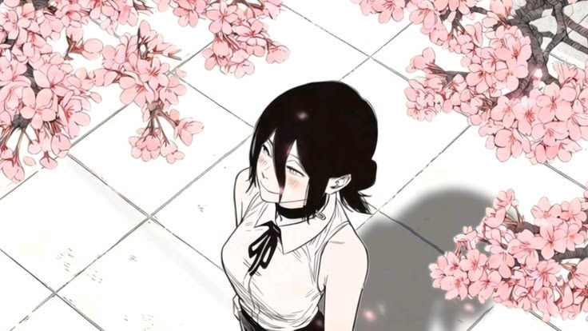
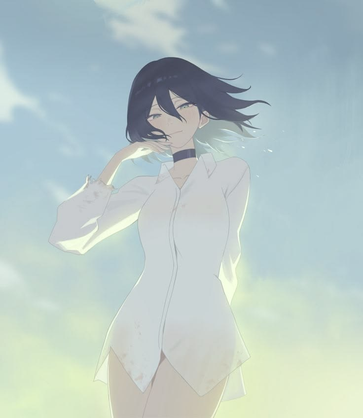
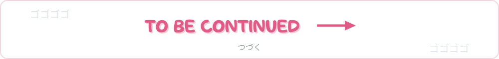

<!--
  GitHub Profile · lazzykid — manga edition
  Этот файл кладётся в репозиторий lazzykid/lazzykid (см. SETUP.md).
  Пометки, которые надо заполнить: TODO-BANNER, TODO-CONTACTS, TODO-ANIME
-->

  

  

<!-- TODO-CONTACTS: раскомментируй блок ниже и вставь свои email и ник в Telegram

  
  

-->

## 📖 Chapter 01 — About Me

**Full-Stack Developer** who treats every project like a good manga arc —
starts strong, no filler, ships every chapter on time.

<!-- Хочешь gif-иконку? Положи её в assets/icon.gif и замени в строке ниже "icon.jpg" на "icon.gif" -->

  

- 🔭 Currently building with **Next.js, React & PostgreSQL**
- 🌱 Always grinding new tech — side quests are welcome
- 💬 Ask me about **Java, C++, TypeScript, Python**
- ⚡ Fun fact: I debug like a manga protagonist — take the hit, power up, try again

## ⚔️ Chapter 02 — Tech Stack

**Languages**

**Frameworks & Databases**

**Tools & Platforms**

## 📊 Chapter 03 — GitHub Stats

  
  
   
  

  

### 🐍 Contribution Snake

  <picture>
    <source media="(prefers-color-scheme: dark)" srcset="https://raw.githubusercontent.com/lazzykid/lazzykid/output/github-contribution-grid-snake-dark.svg" />
    <source media="(prefers-color-scheme: light)" srcset="https://raw.githubusercontent.com/lazzykid/lazzykid/output/github-contribution-grid-snake.svg" />
    
  </picture>

## 🍜 Chapter 04 — When I'm Not Coding

<!-- TODO-ANIME: подставь свои тайтлы — ссылки ведут на MyAnimeList -->

**All-time favorites:** [Steins;Gate](https://myanimelist.net/anime/9253/Steins_Gate) ·
[Fullmetal Alchemist: Brotherhood](https://myanimelist.net/anime/5114/Fullmetal_Alchemist__Brotherhood) ·
[Jujutsu Kaisen](https://myanimelist.net/anime/40748/Jujutsu_Kaisen) ·
[Spirited Away](https://myanimelist.net/anime/199/Sen_to_Chihiro_no_Kamikakushi)

> *"A lesson without pain is meaningless. For that reason, people who exist without pain are incomplete."*
> — Edward Elric · Fullmetal Alchemist

  

