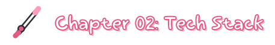
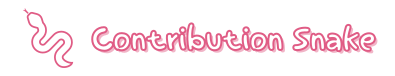
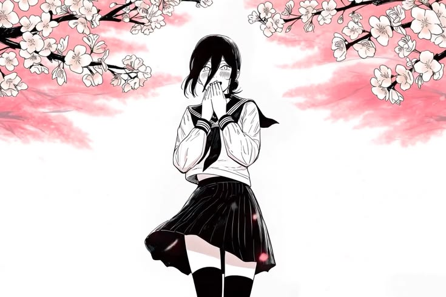

  

  

  

**Full-Stack & Systems Developer**

Building web applications, desktop tools, and custom utilities.

- **Stack:** TypeScript, Node.js, Next.js, PostgreSQL, Prisma
- **Languages:** C++, Rust, Python, Luau
- **Environment:** Windows (Tauri, MSVC)

  

**Languages**

**Frameworks & Databases**

**Tools & Platforms**

  

  
  
   
  

  

  <picture>
    <source media="(prefers-color-scheme: dark)" srcset="https://raw.githubusercontent.com/lazzykid/lazzykid/output/github-contribution-grid-snake-dark.svg" />
    <source media="(prefers-color-scheme: light)" srcset="https://raw.githubusercontent.com/lazzykid/lazzykid/output/github-contribution-grid-snake.svg" />
    
  </picture>

  

**All-time favorites:** [Steins;Gate](https://myanimelist.net/anime/9253/Steins_Gate) ·
[Fullmetal Alchemist: Brotherhood](https://myanimelist.net/anime/5114/Fullmetal_Alchemist__Brotherhood) ·
[Jujutsu Kaisen](https://myanimelist.net/anime/40748/Jujutsu_Kaisen) ·
[Spirited Away](https://myanimelist.net/anime/199/Sen_to_Chihiro_no_Kamikakushi)

> *"A lesson without pain is meaningless. For that reason, people who exist without pain are incomplete."*
> — Edward Elric · Fullmetal Alchemist

  

  

